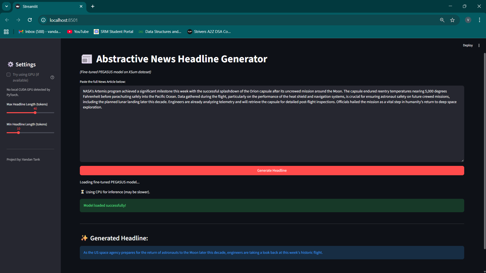

# Comparative Analysis: Transformer Models for Abstractive News Summarization

## Goal
This project compares three Transformer architectures (BART, T5, PEGASUS) for abstractive news headline generation. Models were fine-tuned on the XSum dataset and evaluated using ROUGE scores and qualitative analysis to identify the best approach.

## Dataset
* **Name:** XSum (Extreme Summarization)
* **Source:** BBC Articles (2010-2017)
* **Task:** Generate a single-sentence headline from a news article.
* **Link:** [XSum Dataset on Hugging Face](https://huggingface.co/datasets/EdinburghNLP/xsum)
* **Sample Size:** 5k training, 1k validation, 1k test examples for efficient fine-tuning.

## Methodology
1.  **Environment:** Python 3.10, VS Code, Jupyter Notebooks, `venv`. Key libraries: `transformers`, `datasets`, `evaluate`, `torch`, `streamlit`.
2.  **Preprocessing:** Articles/summaries tokenized using model-specific tokenizers (including handling the `t5-small` prefix). Inputs truncated to 512 tokens, targets to 128.
3.  **Models Compared:**
    * `facebook/bart-base`
    * `t5-small`
    * `google/pegasus-xsum`
4.  **Fine-Tuning:** Models fine-tuned for 3 epochs on Google Colab (T4 GPU) using `Seq2SeqTrainer`. Best checkpoint saved based on validation ROUGE-2 score.
5.  **Evaluation:** Performance measured via ROUGE F1 scores (ROUGE-1, ROUGE-2, ROUGE-Lsum) and qualitative inspection for fluency and factual consistency.

## Results & Analysis

### Quantitative Results (Validation Set @ Epoch 3)

| Model   |   Validation Loss |   Rouge1 |   Rouge2 |   RougeLsum |
| :------ | ------------------: | -------: | -------: | ----------: |
| BART    |              0.72 |    34.37 |    13.57 |       27.75 |
| T5      |              0.67 |    21.11 |     5.44 |       17.31 |
| PEGASUS |              0.55 |    40.35 |    17.94 |       36.06 |

**Findings:** PEGASUS significantly outperformed BART and T5 on all ROUGE metrics, aligning with expectations due to its specialized pre-training. BART showed reasonable adaptation, while T5-small struggled with this task based on ROUGE scores.

### Qualitative Analysis (PEGASUS)

While PEGASUS achieved the best metrics, manual inspection revealed limitations:
* **Factual Hallucination:** Occasional introduction of plausible but incorrect details not present in the source text (e.g., specific summit names, venues).
* **Overly Generic Summaries:** Sometimes lacked crucial specifics for longer, complex articles.

**Example:**
* *Article Snippet:* > The champions paid for a lacklustre first half... Leicester improved but ran into a stubborn home defence...
* *Reference:* > Bournemouth moved to the highest league position... as Leicester's miserable run away from home continued...
* *Generated (PEGASUS):* > Leicester's miserable start to the Premier League season continued as they were beaten at Bournemouth. *(Good, captured key outcome, though minor hallucination of venue occurred in other tests).*

**Conclusion:** PEGASUS is quantitatively superior for this task, but qualitative evaluation shows ROUGE scores don't capture issues like factual consistency. Mixed-method evaluation is crucial for abstractive summarization.

## Demo (Streamlit App)

An interactive Streamlit app demonstrates the fine-tuned PEGASUS model.

**To run locally:**
1. Clone this repository.
2. Navigate to the project directory.
3. Set up and activate a Python virtual environment.
4. Install dependencies:
    ```bash
    pip install -r requirements.txt
    ```
5. Run the Streamlit app:
    ```bash
    streamlit run app.py
    ```
    *(Note: The fine-tuned PEGASUS model (~2.1 GiB) will be downloaded automatically from the Hugging Face Hub the first time you run the app.)*



[**Live Demo on Streamlit Community Cloud**](https://news-summarization-transformers-vt.streamlit.app)

## 📁 File Structure
├── PEGASUS-best-finetuned/ # Fine-tuned PEGASUS model files ├── venv/ # Virtual environment (add to .gitignore) ├── 01_Data_Exploration.ipynb # Data loading and initial analysis ├── 02_Model_Preprocessing.ipynb # Tokenization and data preparation ├── 03_Model_Training.ipynb # Model fine-tuning (run in Colab) ├── app.py # Streamlit application script ├── requirements.txt # Python dependencies └── README.md # This documentation file


---
*Project by: Vandan Tank*